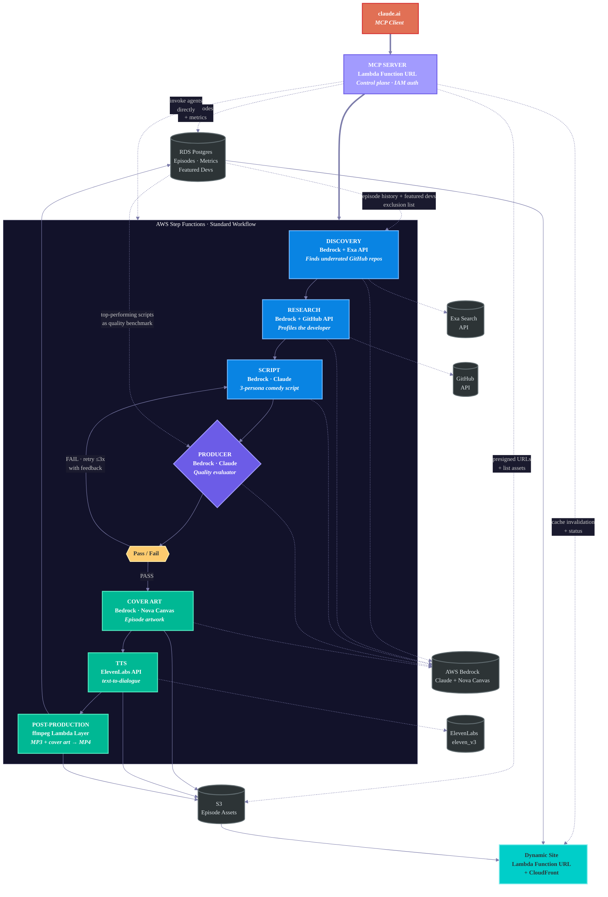

# 0 Stars, 10/10

A multi-agent podcast pipeline on AWS. Seven Lambda functions orchestrated by Step Functions discover underrated GitHub projects, research the developer, write a three-persona comedy script, evaluate it for quality, generate cover art, produce audio, assemble video, and publish to a live website — no human in the loop from trigger to published episode. Two additional Lambdas serve the website and provide an MCP control plane.

**Live site:** [podcast.ryans-lab.click](https://podcast.ryans-lab.click)

| Stat | Value |
|------|-------|
| Episodes published | 2 (textStep by illobo, loopsie by geekforbrains) |
| Avg execution time | ~10 minutes end-to-end |
| Pipeline executions | 43 (16 succeeded, rest were development iteration) |

## Architecture



## The Pipeline

Seven Lambda functions execute in sequence within a Step Functions state machine. Every Lambda has retry logic (exponential backoff, max 3 attempts) and error handling that routes failures to a terminal state. Two additional Lambdas (Site and MCP) run independently outside the pipeline.

**Discovery** — Searches for GitHub repos with fewer than 10 stars using the Exa API. Bedrock Claude Sonnet evaluates candidates against criteria (solo developer, real utility, interesting technical decisions). Queries the `featured_developers` table to avoid repeats and `episode_metrics` to learn from past episode performance.

**Research** — Profiles the selected developer via the GitHub API. Builds structured JSON: notable repos, commit patterns, technical profile, hiring signals, and interesting findings that give the script agents material to work with.

**Script** — Bedrock Claude Sonnet writes a comedy podcast script with three personas (Hype, Roast, Phil). Six segments: intro, core debate, developer deep-dive, technical appreciation, hiring manager pitch, outro. Must stay under 5,000 characters (ElevenLabs API limit), targeting 4,000–4,500.

**Producer** — Evaluator-optimizer loop. Scores the script on structure, persona voice distinctness, character count, and segment quality. Reads top-performing scripts from Postgres as quality benchmarks. On failure, returns structured revision notes. The Script agent retries with that feedback, up to 3 attempts. Implemented as a Step Functions Choice state — the same [evaluator-optimizer pattern](https://docs.aws.amazon.com/prescriptive-guidance/latest/agentic-ai-patterns/evaluator-reflect-refine-loop-patterns.html) from AWS prescriptive guidance.

**Cover Art** — Bedrock Nova Canvas generates episode artwork from a prompt derived from the script. Outputs PNG to S3.

**TTS** — ElevenLabs `eleven_v3` text-to-dialogue API. Three voices: Hype (Eric), Roast (George), Phil (Jessica). Outputs MP3 to S3.

**Post-Production** — ffmpeg (Lambda Layer) combines the MP3 audio and PNG cover art into an MP4. Writes the episode record to RDS Postgres. Records the featured developer to the dedup table.

### Non-Pipeline Lambdas

**Site** — Lambda Function URL fronted by CloudFront serves the podcast website. Jinja2 templates, queries Postgres directly. New episodes appear automatically — no build or deploy step.

**MCP** — Control plane Lambda described in the [MCP Control Plane](#mcp-control-plane) section below.

For full interface contracts and JSON schemas between each Lambda, see [`docs/spec/`](docs/spec/) and [`IMPLEMENTATION_SPEC.md`](IMPLEMENTATION_SPEC.md).

## Cross-Episode Learning

This is not a static pipeline that runs the same way every time. Three feedback loops connect episodes to each other:

1. **Developer dedup.** The `featured_developers` table tracks every developer who has been featured. The Discovery agent queries it before selecting a candidate, so no developer appears twice.

2. **Performance-informed discovery.** The Discovery agent reads `episode_metrics` (LinkedIn engagement data — views, likes, comments, shares) to understand which episodes performed well and bias its search toward similar projects. Metrics are ingested manually today via the MCP `upsert_metrics` tool — this is the one human-in-the-loop step in the system.

3. **Adaptive quality benchmarks.** The Producer agent reads the scripts from top-performing episodes when evaluating new scripts. The quality bar adapts to what actually resonated with the audience, not a static rubric. (Requires metrics from step 2 to be populated.)

## The Personas

| Name | Role | Voice |
|------|------|-------|
| Hype | Relentlessly positive, absurd startup comparisons, would invest in anything | Eric (ElevenLabs) |
| Roast | Dry British wit, nitpicks everything, grudgingly respects good work | George (ElevenLabs) |
| Phil | Over-interprets READMEs, asks existential questions about code | Jessica (ElevenLabs) |

## MCP Control Plane

A FastMCP server running on Lambda (Function URL, IAM auth) exposes 26 tools across 6 modules. This is how the pipeline is triggered and monitored from claude.ai — no AWS console needed.

| Module | Tools | What they do |
|--------|-------|-------------|
| Pipeline | 5 | Start/stop executions, get status, list runs, retry from mid-pipeline |
| Agents | 7 | Invoke any individual Lambda directly (discovery, research, script, producer, cover art, TTS, post-production) |
| Observation | 3 | CloudWatch logs by agent, full execution history with I/O, pipeline health (success/fail rates) |
| Data | 6 | Query episodes, get full episode detail, query metrics, query featured developers, read-only SQL, upsert metrics |
| Assets | 3 | Presigned URLs for episode assets, list S3 contents |
| Site | 2 | CloudFront cache invalidation, distribution + cert status |

## Methodology: Spec-First Autonomous Implementation

The entire system was built spec-first. 16 specification documents in [`docs/spec/`](docs/spec/) define exact function signatures, JSON contracts between every Lambda, database DDL, Terraform resource maps, agent prompts, test plans, and deployment procedures. These were written and reviewed before any production code existed.

The implementation was then executed autonomously by [Ralph Wiggum](ralph.sh) — a bash harness that feeds tasks from the spec into Claude (Sonnet), validates each output against the test suite, auto-commits on success, retries on failure, and runs convergence passes for formatting, linting, and tests until the suite is green.

First autonomous run (2026-03-29): 1 hour 40 minutes, 53 iterations across 42 tasks, ending with 297 unit tests passing across 21 test files. Ruff formatting converged in 1 pass. Linting (ruff + mypy) took 10 iterations. Tests went from 165 pass / 31 fail / 11 error to 201 pass / 0 fail in 6 iterations, with 96 additional tests added in a follow-up commit.

The spec documents served as both the build instructions for the autonomous agent and the acceptance criteria for the output. The agent never saw the "big picture" — it worked task by task against the spec, and the test suite enforced correctness.

## Lessons Learned

Two classes of bugs shipped to production despite 297 passing unit tests. Both are documented with full root-cause analysis in [`LESSONS_LEARNED.md`](LESSONS_LEARNED.md).

**MCP handler bugs (2026-03-31).** Four bugs in the MCP Lambda handler — ASGI lifespan, DNS rebinding, stateful sessions, SSE streaming — all caused by the same gap: no test ever called `lambda_handler()`. Every test imported tool functions directly, bypassing the Lambda handler, ASGI adapter, and MCP transport layer entirely. The entire path from HTTP request to JSON-RPC response was untested.

**CloudFront path mismatch (2026-04-01).** Cover art images existed in S3 but returned 403 errors on the site. The site handler prepended `/assets/` to S3 keys when building URLs, but CloudFront forwarded the full path to S3, so the requested key never matched. Each component was correct in isolation — the bug lived in the seam between them.

Both bugs reinforce the same lesson: test at the boundary, not just the internals. Tool logic tests validate the implementation, but the contract is "HTTP request in, correct response out." The post-mortems include the specific tests that would have caught each bug.

## Infrastructure

Everything is Terraform. Everything is serverless.

| Component | Service | Purpose |
|-----------|---------|---------|
| Orchestration | Step Functions (Standard) | Agent pipeline with evaluator loop |
| Compute | Lambda (Python) | One function per agent |
| Models | Bedrock (Claude Sonnet 4, Nova Canvas) | Agent reasoning + image generation |
| TTS | ElevenLabs API | Multi-voice podcast audio |
| Storage | S3 | Episode assets (MP3, MP4, cover art) |
| Database | RDS Postgres | Episode catalog, metrics, featured devs |
| Website | Lambda Function URL + CloudFront | Dynamic podcast site |
| Control Plane | MCP Server (Lambda Function URL) | 26 tools for pipeline management via claude.ai |
| Secrets | Secrets Manager | API keys (ElevenLabs, Exa) |
| Monitoring | CloudWatch + SNS | Logs, alarms, alerting |
| Media | Lambda Layer (ffmpeg) | Audio + image → video |

## Cost

Per-episode cost for a single pipeline execution:

| Service | Cost |
|---------|------|
| Bedrock (Claude Sonnet) | ~$0.50–2.00 depending on retries |
| Bedrock (Nova Canvas) | ~$0.04 |
| ElevenLabs TTS | ~$0.10–0.30 at current script lengths |
| Lambda compute | Free tier (7 invocations/episode) |
| Step Functions | Negligible (~10 state transitions) |
| S3 + CloudFront | Minimal storage and transfer |
| RDS Postgres | Shared instance, no incremental cost |

Total: well under $3/episode. Typical execution closer to $1.

## Repo Structure

```
terraform/              Terraform IaC — all AWS resources
lambdas/
  shared/               Lambda Layer: bedrock, db, s3, logging, tracing, metrics, types
  discovery/            Exa search + Bedrock evaluation
  research/             GitHub API + Bedrock profiling
  script/               Three-persona comedy script generation
  producer/             Evaluator-optimizer quality gate
  cover_art/            Nova Canvas image generation
  tts/                  ElevenLabs text-to-dialogue
  post_production/      ffmpeg assembly + DB write
  site/                 Dynamic website (Jinja2 + Postgres)
  mcp/                  MCP control plane (26 tools, 5 resources)
layers/ffmpeg/          ffmpeg binary as Lambda Layer
sql/                    Database schema definitions
tests/
  unit/                 297 tests across 21 files
  integration/          Behavioral twins + real Bedrock (Haiku)
  e2e/                  29 tests against deployed infrastructure
docs/spec/              16 specification documents
```

## Deployment

```bash
cd terraform
terraform init
terraform plan
terraform apply
```

Required variables:
- `elevenlabs_api_key` — ElevenLabs API key for TTS
- `exa_api_key` — Exa Search API key for Discovery agent
- `db_connection_string` — Postgres connection string
- `mcp_allowed_principal` — IAM principal ARN for MCP Function URL auth

Optional variables with defaults:
- `domain_name` (default: `podcast.ryans-lab.click`)
- `project_prefix` (default: `zerostars`)
- `alert_email` (default: `""`)
- `pipeline_failure_threshold` (default: `1`)
- `lambda_error_threshold` (default: `1`)
- `lambda_timeout_threshold_ms` (default: `270000`)
- `producer_fail_threshold` (default: `3`)

## License

MIT
