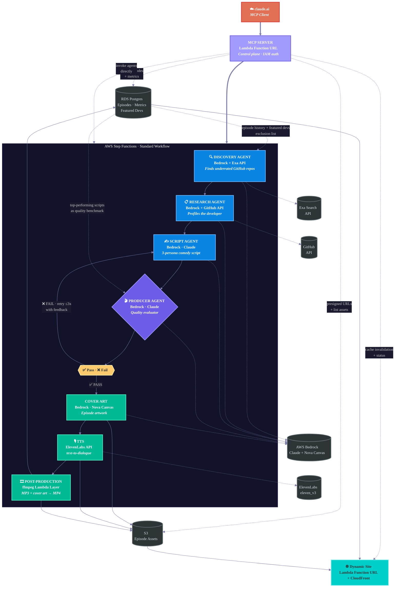

# 0 Stars, 10/10

A closed-loop multi-agent podcast pipeline on AWS. AI agents collaborate to discover an underrated GitHub project, research the developer, write a comedy podcast script, evaluate it, generate cover art, produce audio, and publish the episode. An MCP server exposes the entire pipeline as tools on claude.ai — trigger episodes, invoke individual agents, observe logs, query the database, and manage assets from a conversation.

Three AI personas — **Hype** (the relentless optimist), **Roast** (dry British wit), and **Phil** (the existential philosopher) — discuss small, obscure GitHub projects with very few stars and hype up the developers who built them.

**Live site:** [podcast.ryans-lab.click](https://podcast.ryans-lab.click)

## How This Was Built

The entire codebase was scaffolded by a single autonomous run of [Ralph Wiggum](ralph.sh) — a bash harness that feeds tasks from a spec into Claude (Sonnet), validates each output, auto-commits on success, retries on failure, then runs convergence passes for formatting, linting, and tests until the suite is green. No human in the loop.

**First run results** (2026-03-29):

| Phase | Detail |
|-------|--------|
| Model | Claude Sonnet |
| Wall clock | 1 h 40 min |
| Build | 53 iterations across 42 tasks — 34 completed, 6 blocked (shared import issue), 2 skipped |
| Format | Ruff — 1 pass |
| Lint | Ruff + mypy — 10 iterations, 19 errors → 1 |
| Tests | pytest — 6 iterations, 165 pass / 31 fail / 11 error → **201 pass / 0 fail / 0 error** |

The 6 blocked tasks were all MCP tool modules that failed validation because an earlier task committed `__init__.py` with absolute imports (`from tools import agents`) that only resolve inside the Lambda runtime, not from the repo root. Sonnet diagnosed the root cause correctly every attempt but couldn't fix it — the file was out of scope for the task. These were fixed by hand after the run.

## Architecture



### Pipeline Flow

```
claude.ai (MCP Client)
        │
        ▼
MCP Server Lambda (Function URL · IAM auth)
        │
        ▼
Step Functions State Machine (Standard)
        │
        ├──► Discovery Agent Lambda
        │      Bedrock + Exa API
        │      Queries episode history + featured devs to avoid repeats
        │
        ├──► Research Agent Lambda
        │      Bedrock + GitHub API
        │      Developer profile, repos, commit patterns, backstory
        │
        ├──► Script Agent Lambda
        │      Bedrock (Claude)
        │      Three-persona comedy script, <5000 chars
        │
        ├──► Producer Agent Lambda (evaluator)
        │      Bedrock (Claude)
        │      Reads top-performing scripts from Postgres as benchmark
        │      Quality gate: structure, persona voice, char count
        │      ─── Choice State ───
        │          FAIL → back to Script Agent (max 3 attempts)
        │          PASS → continue
        │
        ├──► Cover Art Lambda
        │      Bedrock (Nova Canvas)
        │      Generates episode artwork from prompt
        │      PNG → S3
        │
        ├──► TTS Lambda
        │      ElevenLabs text-to-dialogue API
        │      MP3 → S3
        │
        └──► Post-Production Lambda
               ffmpeg: cover art + audio → MP4
               Writes episode record to RDS Postgres
               Uploads final assets to S3
```

The podcast website is a **dynamic site** — a Lambda Function URL backed by Postgres, fronted by CloudFront. It reads from the same `episodes` table the pipeline writes to, so new episodes appear automatically without a build or deploy step.

### Agent Design Patterns

**Evaluator-optimizer loop.** The Producer agent evaluates the Script agent's output against a rubric (character count, segment structure, persona voice distinctness, hiring segment specificity). On failure, it returns structured feedback that the Script agent uses on its next attempt. This is implemented as a Step Functions Choice state with a retry counter — the same pattern AWS documents in their [prescriptive guidance for agentic AI](https://docs.aws.amazon.com/prescriptive-guidance/latest/agentic-ai-patterns/evaluator-reflect-refine-loop-patterns.html).

**Cross-episode learning.** The Discovery agent queries the `episodes` and `featured_developers` tables to avoid repeating projects or developers. The Producer agent reads top-performing scripts from Postgres as quality benchmarks, so the quality bar adapts to what resonates with the audience rather than relying on a static rubric alone. Engagement-based search biasing (via `episode_metrics`) is planned as a future feature.

**Tool use.** The Discovery and Research agents use Bedrock's tool-use capabilities to call external APIs (Exa search, GitHub API) as part of their reasoning, rather than hardcoded API-then-LLM sequences.

## Infrastructure

Everything is Terraform. Everything is serverless.

| Component | Service | Purpose |
|-----------|---------|---------|
| Orchestration | Step Functions (Standard) | Agent pipeline with evaluator loop |
| Compute | Lambda (Python) | One function per agent |
| Models | Bedrock (Claude) | All agent reasoning |
| Image Gen | Bedrock (Nova Canvas) | Episode cover art |
| TTS | ElevenLabs API | Multi-voice podcast audio |
| Storage | S3 | Episode assets (MP3, MP4, cover art) |
| Database | RDS Postgres | Episode catalog, metrics, featured devs |
| Website | Lambda Function URL + CloudFront | Dynamic podcast site |
| Control Plane | MCP Server (Lambda) | Pipeline trigger, observation, management via claude.ai |
| Secrets | Secrets Manager | API keys (ElevenLabs, Exa) |
| Monitoring | CloudWatch | Logs, alarms |
| Media | Lambda Layer (ffmpeg) | Audio → video conversion |

## Repo Structure

```
├── terraform/
│   ├── main.tf
│   ├── variables.tf
│   ├── outputs.tf
│   ├── lambdas.tf
│   ├── step-functions.tf
│   ├── s3.tf
│   ├── site.tf
│   ├── secrets.tf
│   ├── observability.tf
│   └── mcp.tf
├── lambdas/
│   ├── shared/                  # Lambda Layer: Bedrock client, DB helpers, S3 utils
│   ├── discovery/
│   │   ├── handler.py
│   │   └── prompts/discovery.md
│   ├── research/
│   │   ├── handler.py
│   │   └── prompts/research.md
│   ├── script/
│   │   ├── handler.py
│   │   └── prompts/script.md
│   ├── producer/
│   │   ├── handler.py
│   │   └── prompts/producer.md
│   ├── cover_art/
│   │   ├── handler.py
│   │   └── prompts/cover_art.md
│   ├── tts/
│   │   └── handler.py
│   ├── post_production/
│   │   └── handler.py
│   ├── site/
│   │   ├── handler.py
│   │   └── templates/
│   └── mcp/                   # MCP control plane (26 tools, 5 resources)
│       ├── handler.py
│       ├── resources.py
│       └── tools/
├── layers/
│   └── ffmpeg/
├── sql/
│   └── schema.sql
├── tests/
│   ├── unit/
│   ├── integration/
│   └── e2e/
└── README.md
```

## Database Schema

Three tables in the existing RDS Postgres instance:

**`episodes`** — Episode catalog. Powers both the pipeline and the website.

| Column | Type | Notes |
|--------|------|-------|
| episode_id | serial | PK |
| air_date | date | |
| repo_url | text | |
| repo_name | text | |
| developer_github | text | |
| developer_name | text | |
| star_count_at_recording | int | |
| script_text | text | Full approved script |
| research_json | jsonb | Research agent output |
| cover_art_prompt | text | Prompt sent to Nova Canvas |
| s3_mp3_path | text | |
| s3_mp4_path | text | |
| s3_cover_art_path | text | |
| producer_attempts | int | How many script iterations |
| created_at | timestamptz | |

**`episode_metrics`** — LinkedIn performance, updated periodically.

| Column | Type | Notes |
|--------|------|-------|
| metric_id | serial | PK |
| episode_id | int | FK → episodes |
| linkedin_post_url | text | |
| views | int | |
| likes | int | |
| comments | int | |
| shares | int | |
| snapshot_date | date | |

**`featured_developers`** — Dedup list for the Discovery agent.

| Column | Type | Notes |
|--------|------|-------|
| developer_github | text | PK |
| episode_id | int | FK → episodes |
| featured_date | date | |

## The Podcast

### Personas

| Name | Role | Voice |
|------|------|-------|
| Hype | The Hype Beast — relentlessly positive, absurd startup comparisons | Eric (ElevenLabs) |
| Roast | The Roast Master — dry British wit, grudgingly respects good work | George (ElevenLabs) |
| Phil | The Philosopher — over-interprets READMEs, existential questions | Jessica (ElevenLabs) |

### Episode Structure

1. Intro & project reveal
2. Core debate (comedy centerpiece around an interesting technical decision)
3. Developer deep-dive (GitHub profile, other projects, backstory)
4. Technical appreciation (Roast's grudging compliment = emotional turn)
5. "Hiring manager" segment (each persona explains why this project signals talent)
6. Outro with callbacks

### Constraints

- ElevenLabs text-to-dialogue API: **5,000 character limit** per request
- Target script length: 4,000–4,500 characters
- Three voices max per episode
- TTS model: `eleven_v3`
- Output: `mp3_44100_128`

## Deployment

```bash
cd terraform
terraform init
terraform plan
terraform apply
```

Required variables:
- `elevenlabs_api_key`
- `exa_api_key`
- `rds_connection_string` (existing instance)
- `domain_name` (for CloudFront + Route53)

## Cost

Targeting near-zero monthly cost for weekly execution:

- **Lambda:** ~7 invocations/week (pipeline) + site traffic, well within free tier
- **Step Functions:** ~10 state transitions/week, negligible
- **Bedrock (Claude):** ~$0.50–2.00/episode depending on retries
- **Bedrock (Nova Canvas):** ~$0.04/image
- **ElevenLabs:** Per character, ~$0.10–0.30/episode at current script lengths
- **S3 + CloudFront:** Minimal storage and transfer
- **RDS:** Shared instance, no incremental cost

## License

MIT
